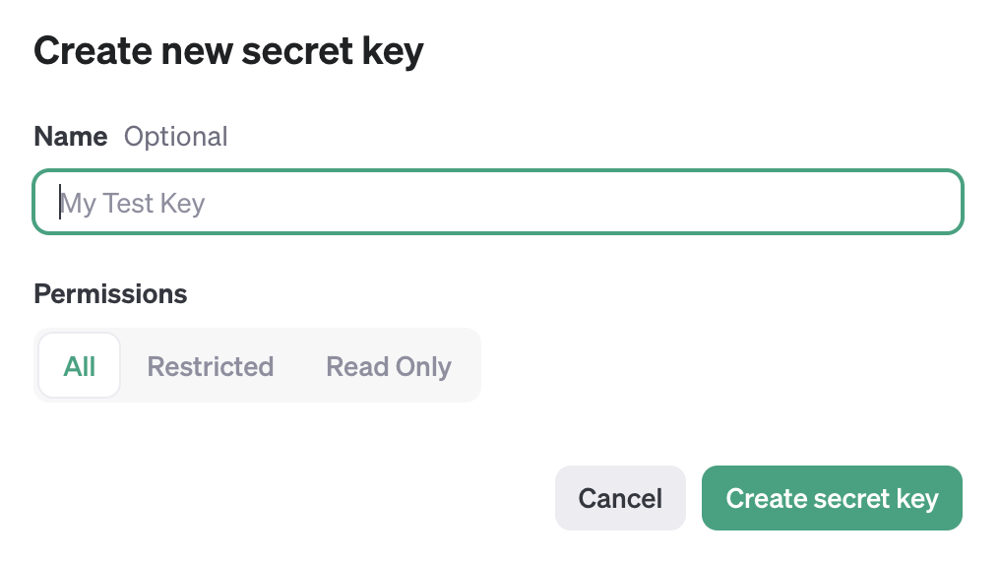

## Python

```bash
conda create -n llm_text_annotation -y python=3.11 pip
conda install notebook
pip install -r setup/requirements.txt
```

## Open AI API credentials

### 1. Create an account on OpenAI

Go to [OpenAI](https://beta.openai.com/signup/) and create an account.

### 2. Get your API key

Go to the [API keys](https://platform.openai.com/api-keys) page.

Create a new API key by clicking on the "Create new secret key" button.

Fill your information in the form show below ... 



... and click on the "Create secrete "  button.

**_Note_** &emdash; 
This will be the only time you will be able to see your API key. 
Make sure you **take the next** step described below to store it in a safe place.

### 3. Make your API key accessible in python

Create a file called `.env` in the root of your project folder.

Open it in a text editor and

1. add `OPENAI_KEY=` in the first line of the file, 
2. copy your API key from your browser window,
3. paste the key it in your `.env` file behind the `=`
4. save the file and close it

**_Alternatively_** &emdash; Directly create the .env file like this:

```bash
echo "OPENAI_KEY=<insert your key here>" > .env
```