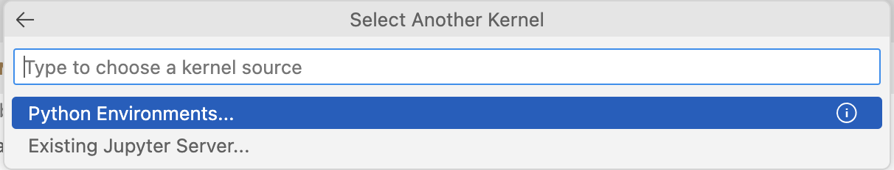
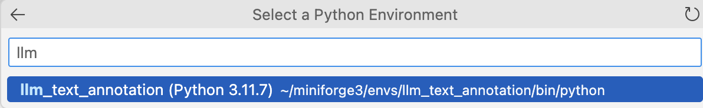

# Materials for the Workshop "Hands-On Text Coding with Large Language Models for Social Scientists"

| Authors | Last update |
|:------ |:----------- |
| Hauke Licht (https://github.com/haukelicht) | 2024-02-14 |

This repository contains the materials for the workshop "Hands-On Text Coding with Large Language Models for Social Scientists."

## Setup 


We will be using Visual Studio Code (VS Code) as a code editor in the workshop.
Please install **VS Code** before from https://code.visualstudio.com/Download.

You will also need to install **Python**, if you have not done so before. 
You can download and install it as described here: https://www.python.org/downloads.

Next, you need to install the `conda` package manager as described here: https://conda.io/projects/conda/en/latest/user-guide/install.

Finally, in VS code, you also need to install the Python and Jupyter **extensions**.
You can do this by clicking on the "Extensions" icon in the left-hand sidebar, searching for "Python" ("Jupyter") and clicking on the "Install" button.

You shouldn't run into any issues if you have admin rights on your computer.
But if you run into difficulties, please check https://code.visualstudio.com/docs/languages/python.
If you don't find a solution, you can also email me at `hauke.licht [at] wiso [dot] uni-koeln [dot] de`.


### Conda environment

To ensure that everyone uses the same python and packages versions, we will create and use a virtual conda environment.

```bash
conda create -n llm_text_annotation -y python=3.11 pip
conda activate llm_text_annotation
conda install notebook
pip install -r setup/requirements.txt
```

When running some python script or a cell in a Jupyter notebook in VS Code, you will be prompted to select the python interpreter.



In our case, we will always select the `llm_text_annotation` environment:



<br>


**_Alternatives_** 

- create a native python virtual environment (like [this](https://realpython.com/lessons/creating-virtual-environment/)), and/or
- install the required python packages listed the [requirements.txt](setup/requirements.txt) file manually

### Open AI API access

#### 1. Create an account on OpenAI

Go to [OpenAI](https://beta.openai.com/signup/) and create an account.

#### 2. Link a payment method and book some credit

1. go to platform.openai.com/account/billing/overview
2. link a valid credit card
3. click "Add to credit balance" and load a credit of, e.g., 10 dollars

#### 3. Get your API key

Go to the [API keys](https://platform.openai.com/api-keys) page.

Create a new API key by clicking on the "Create new secret key" button.

Fill your information in the form show below ... 


... and click on the "Create secrete "  button.

**_Note_** &mdash; 
This will be the only time you will be able to see your API key. 
Make sure you **take the next** step described below to store it in a safe place.


#### 4. Make your API key accessible in python

Create a file called `.env` in the root of your project folder.

Open it in a text editor and

1. add `OPENAI_API_KEY=` in the first line of the file, 
2. copy your API key from your browser window,
3. paste the key it in your `.env` file behind the `=`
4. save the file and close it

**_Alternatively_** &mdash; Directly create the `.env` file like this:

```bash
echo "OPENAI_API_KEY=<insert your key here>" > .env
```

#### 5. Verify that your API key is accessible in python

Run the code in notebook [test_openai_key.ipynb](./code/test_openai_key.ipynb) to verify that your API key is accessible in python.

## Questions and issues

If you have a question or encounter any issues, email me at `hauke.licht [at] wiso [dot] uni-koeln [dot] de` or [post an issue](https://github.com/haukelicht/llm_text_coding/issues).
